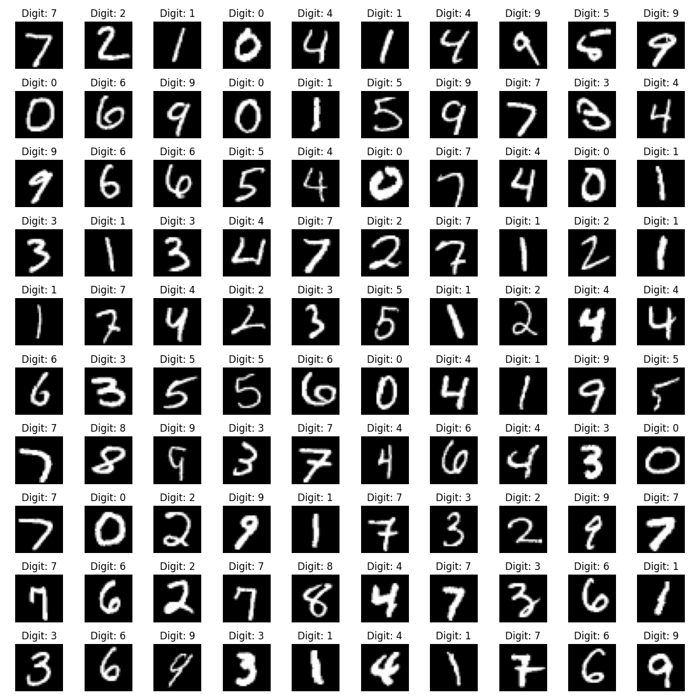
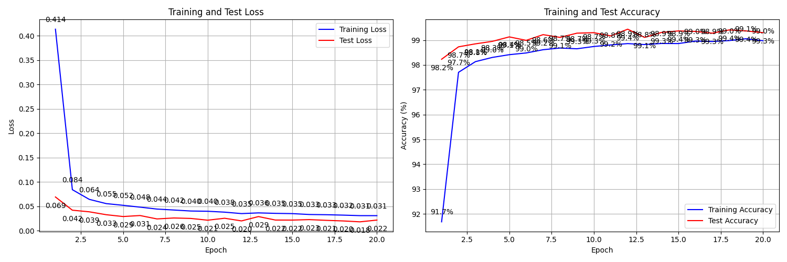

# MNIST Classifier with PyTorch

A lightweight CNN architecture for MNIST digit classification, focusing on efficient design principles and modern best practices. The model achieves high accuracy while maintaining a parameter count below 20k.

## 🎯 Model Architecture Highlights

- **Parameter Efficient**: < 20k total parameters
- **Modern Practices**: 
  - Batch Normalization for stable training
  - Dropout layers for regularization
  - Global Average Pooling instead of Dense layers
  - Strategic use of residual connections

## 📊 Dataset Overview

The MNIST dataset consists of 28x28 grayscale images of handwritten digits (0-9). Let's visualize some training examples:

```python
import matplotlib.pyplot as plt
import torchvision
import torch
import numpy as np

# Load MNIST dataset
train_dataset = torchvision.datasets.MNIST('./data', train=False, download=True)

# Create a 10x10 grid of images
fig, axes = plt.subplots(10, 10, figsize=(12, 12))
for i in range(10):
    for j in range(10):
        idx = i * 10 + j
        img = train_dataset.data[idx].numpy()
        label = train_dataset.targets[idx].item()
        axes[i, j].imshow(img, cmap='gray')
        axes[i, j].axis('off')
        axes[i, j].set_title(f'Digit: {label}')
plt.tight_layout()
plt.savefig('assets/mnist_examples.png')
plt.show()
```



### Data Augmentation Strategy

Our training pipeline includes carefully chosen augmentations to improve model robustness:

```python
transforms.Compose([
    transforms.RandomRotation((-7.0, 7.0), fill=(1,)),
    transforms.ToTensor(),
    transforms.Normalize((0.1307,), (0.3081,))
])
```

1. **Random Rotation (-7° to 7°)**
   - Purpose: Simulates natural handwriting variations
   - Fill Value (1): Uses white fill for rotated edges to match MNIST background
   - Impact: Makes model robust to slightly tilted digits

2. **Normalization (mean=0.1307, std=0.3081)**
   - Purpose: Standardizes pixel values to improve training stability
   - Values chosen based on MNIST dataset statistics
   - Impact: Helps with faster convergence and better gradient flow

## 📈 Training Results

Our model achieves competitive performance on the MNIST dataset:



## 🛠 Project Structure

```
mnist_classifier/
├── .github/
│   └── workflows/
│       └── model-tests.yml
├── data/                    # Dataset storage
├── metric_results/          # Training metrics and visualizations
├── model.py                 # Model architecture definition
├── train.py                # Training script
├── test_model_architecture.py  # Architecture tests
└── README.md
```

## 💻 Installation

```bash
# Clone the repository
git clone https://github.com/your-username/mnist-classifier.git
cd mnist-classifier

# Install dependencies
pip install -r requirements.txt
```

## 🚀 Training the Model

```bash
python train.py
```

The script will:
1. Download the MNIST dataset (if not present)
2. Train the model for 20 epochs
3. Save training metrics and model weights
4. Generate visualization plots

## 🔍 Model Architecture Tests

We use GitHub Actions to automatically verify the model's architectural constraints:

1. **Parameter Count**: Ensures total parameters < 20k
2. **Batch Normalization**: Verifies the use of BatchNorm layers
3. **Dropout**: Confirms the presence of Dropout layers
4. **Architecture**: Checks for GAP instead of Dense layers

Run tests locally:
```bash
pytest test_model_architecture.py
```

## 📝 Model Details

```python
class MNISTClassifier(nn.Module):
    def __init__(self):
        super(MNISTClassifier, self).__init__()
        # Architecture details...
```

Key components:
- Convolutional blocks
- Batch normalization after each conv layer
- Dropout for regularization
- Global Average Pooling
- No fully connected layers

## 📊 Training Parameters

- Batch Size: 64
- Learning Rate: 0.001
- Optimizer: Adam
- Loss Function: Cross-Entropy
- Epochs: 20
